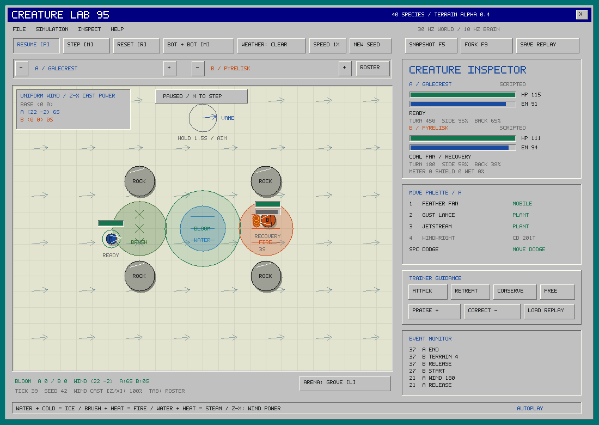

# Creature Lab 95 — terrain alpha 0.4

A deterministic C++ creature-combat engine with **40 playable species, 160 signature moves, 40 passives**, and a deliberately simple native Windows 95-style workbench. Each species has a distinct setup, payoff, weakness and learning problem. The opponents are scripted; the future progression system is learned policy, not XP-scaled stats.



## Start here

- **[Terrain and wind systems](docs/alpha/terrain.md)** — reactive surfaces, timed vector fields, move interactions and the neutral wind vane.
- **[Movement and casting commitments](docs/alpha/movement.md)** — facing, turning, directional speed, lateral dodge, planted/mobile casts and current validation.
- **[Core design and combat rules](docs/alpha/design.md)** — eight gameplay axes, counterplay, resource economy, the bloom objective, alpha boundaries.
- **[40-species field guide](docs/alpha/species.md)** — every kit, exact numbers, winning pattern, counterplay and learning test.
- **[Passive contracts](docs/alpha/passives.md)** — all 40 executable mechanics.
- **[Current terrain balance diagnostic](reports/terrain-v4-balance.md)** — full matrix, aggregate rates and worst pairings.
- **[RL / C API schema](docs/integration.md)** and **[verification](docs/alpha/terrain.md#validation)**.

## Build and play

C++17 compiler required; only the viewer needs SDL2 2.0.18+. The headless core has no third-party library dependencies.

```sh
# macOS: install command-line developer tools, then:
brew install sdl2
make all test
./build/creature_lab

# Ubuntu / Linux:
sudo apt-get install build-essential libsdl2-dev python3
make all test
./build/creature_lab
```

On this Mac, double-click `Launch.command`. `scripts/package-macos.sh` produces a local `.app` bundle using the installed SDL2. CMake supports native builds including Windows:

```sh
cmake -S . -B build-cmake -DCREATURE_VIEWER=OFF -DCMAKE_BUILD_TYPE=Release
cmake --build build-cmake --config Release
ctest --test-dir build-cmake -C Release --output-on-failure
```

Enable the CMake viewer with an SDL2 package installed (for example via vcpkg on Windows). The Python bridge can use `CREATURE_LIB=/absolute/path/to/library` for non-Make layouts.

## Workbench controls

- **Tab / Roster:** browse 40 species, select for A or B. The `-` / `+` controls cycle either side.
- **P:** pause/resume. **N:** one decision (three simulation ticks). **R:** restart seed.
- **M:** human A versus bot B, or two bots. Human uses **WASD**, **mouse aim**, **1–4**, **Space + WASD dodge** (no movement input defaults to a right sidestep). Clicking a move selects human control and requests that move.
- Ground-targeted fields/traps/turrets land at the cursor up to their maximum cast range. The mouse requests facing; turn speed limits how quickly the body follows. Directional attacks lock physical facing at cast start. Most casts plant; the move palette labels mobile exceptions.
- **Z / X:** decrease/increase wind-cast strength in 25% steps. Mouse sets requested heading; the field uses facing when the cast begins.
- **Wind vane:** hold its circle uncontested for 1.5 seconds, facing the desired flow direction, to create a five-second gust.
- **L:** cycle pillars/grove/open arena. Weather and new seed are toolbar controls. Match setting changes restart.
- **F5 / F9:** snapshot / restore a replay branch. Save/load replay records actions, guidance, feedback and per-decision hashes.
- Guidance is policy input; praise/correction are recorded learning annotations. They do not change physics or weights.

The bloom wins at 600 uncontested control points, with a one-second capture preparation. KO takes priority. After 60 seconds the boundary contracts; at 90 seconds control then health fraction adjudicates. Shield/guard, status meters, visible traps, destructible turrets, attack geometry and the event monitor make the fundamentals inspectable.

```sh
./build/creature_lab --species-a 21 --species-b 8 --arena 1
# Species CLI IDs are zero-based; catalog displays 1–40.
```

## Test, simulate, tune

```sh
make test                         # content validation + native + Python FFI
make build/tournament
./build/tournament 36 reports/matches.csv 3000
python3 scripts/analyze_balance.py reports/matches.csv reports/balance
python3 python/rollout.py --arenas 256 --decisions 1000
```

The 36-seed protocol runs 56,160 matches across all 780 unordered pairs, both seats, nine map/weather conditions and four style pairings. This is **scripted baseline evidence**, not proof of learned-policy balance. Raw calibration/holdout CSVs and every numeric tuning intervention are included. **Terrain v4 is a systems playtest, not balance certification.** The linked diagnostic contains current measurements. Earlier v2/v3 reports remain historical evidence; terrain and wind require species-specific pilot and human playtests.

Edit `content/roster.json`, then run `make content`. The generator compiles immutable C++ tables and regenerates the field guide. JSON is not loaded in the simulation loop. Rules and observation schema are v4; old prototype saves/models fail compatibility checks.

## RL integration

The dependency-free Python batch API exposes both creatures, legal actions, semantic own/announced move tokens, public entity/status/passive state, objective pressure and reward features. Optional examples:

```sh
python3 -m venv .venv
.venv/bin/pip install -r python/requirements-ml.txt
.venv/bin/python python/policy.py
.venv/bin/python python/gym_env.py
```

The 82,627-parameter recurrent model scores actual move tokens, with continuous motion/aim and masked ability selection. The Gymnasium wrapper supports a custom hybrid-action learner. Both have integration tests; **no trained policy or RL learner is shipped**. Unity presentation, persistent individual adaptation, campaign/economy and online services remain future work. The engine/content is playable alpha; competitive balance needs human and trained-agent evidence.

MIT licensed; original placeholder creatures and pixel font, no franchise assets.
