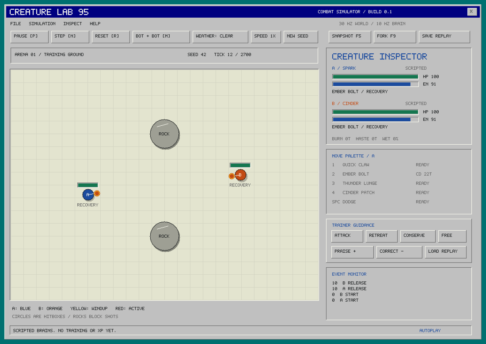

# Creature Lab 95

A small, deterministic creature-combat engine and a deliberately simple Windows 95-style workbench. **The creature's eventual progression is its learned policy, not an XP multiplier.** This repository establishes the simulation and model boundary; the included opponents are scripted, not trained.



## Run

Requires a C++17 compiler. The headless engine has **no third-party dependencies**. Python 3 is optional. Only the native viewer requires SDL2 (2.0.18 or newer).

```sh
# macOS (Apple command-line developer tools + Homebrew)
brew install sdl2
make
make test
./build/creature_lab

# Linux / Ubuntu
sudo apt-get install build-essential libsdl2-dev python3
make
make test
./build/creature_lab
```

On macOS, double-click `Launch.command` after installing the prerequisites. It builds and launches the viewer. `scripts/package-macos.sh` also produces a local `.app` bundle (it still depends on your installed SDL2).

Headless builds do not need SDL:

```sh
make core
./build/benchmark
python3 python/rollout.py --arenas 256 --decisions 1000
```

CMake is also supported: `cmake -S . -B build-cmake -DCREATURE_VIEWER=OFF`, then `cmake --build build-cmake --config Release` and `ctest --test-dir build-cmake -C Release`. For Windows, enable the viewer with an SDL2 CMake package (for example via vcpkg). Windows has not yet been exercised locally. The Python bridge accepts an explicit shared-library path through `CREATURE_LIB`.

## Workbench

- **P** pause/resume; **N** advance one decision (three physics ticks).
- **M** switch between two bots and human A versus bot B.
- Human: **WASD** movement, **mouse** aim, **1–4** moves, **Space** dodge. A key press requests a move once. Requests during recovery/cooldown are ignored; they are not buffered.
- **R** restart the same seed. **New seed** changes starting jitter; weather presets restart the episode.
- **F5** snapshot; **F9** restore and begin a fresh replay branch.
- **Save replay / Load replay** write/read `captures/battle.crr`. Loading verifies every recorded state hash before playback.
- Guidance is an input to A's policy. The baseline implements simple attack/retreat/conserve responses. Human control bypasses guidance.
- Praise/correction enter the next decision's experience record. They do not change stats, health, or model weights. Inputs at the end of an episode require a new episode.

Blue/orange circles are creature colliders. Yellow shows windup; orange shows active melee geometry. Rock circles block movement and shots. Fire circles persist and can damage their owner. Projectile telegraph lines show initial aim/range, not the wind-curved trajectory. The inspector is an omniscient debugging tool; actor observations deliberately expose less.

## What is implemented

- C++17, 30 Hz integer kinematics; 10 Hz policy decisions with movement/aim held for three ticks and a single move request per decision.
- Two creatures, five data-described moves: Quick Claw, Ember Bolt, Thunder Lunge, Cinder Patch, Dodge.
- Startup/active/recovery, energy/cooldown, collision, knockback, interruptible startup, evasive frames, burn, a haste buff, wind drift, rain/wetness affecting traction and fire persistence.
- Simultaneous hit collection, double-KO draws, independent 90-second time-limit truncation, terminal no-op behavior.
- Fixed-capacity projectiles, zones, and observable event history. Pool overflow is counted and emitted as an event.
- Explicit, versioned, little-endian snapshots with checksums and validation. In-memory forks are simple world copies.
- Action replays with per-decision hashes and trainer feedback; no dependency on policy inference to replay a fight.
- Versioned C ABI, dependency-free Python batch wrapper, normalized structured observations, legal-action masks, and reward features.
- Optional **68,903-parameter PyTorch recurrent policy** with tested inference, action submission, and gradients. Random weights only; no trained checkpoint or PPO learner is included.

```sh
python3 -m venv .venv
.venv/bin/pip install -r python/requirements-ml.txt
.venv/bin/python python/policy.py
```

## Architecture and design judgment

The simulator is authoritative. SDL consumes it; a future Unity client can call the same C ABI. Rendering, inference, gradient updates, and policy memory are outside the physics engine. There is no Unity/PhysX, Torch, networking, or wall-clock dependency in the core.

I retained the original discussion's state-first simulator, public observations, separate training process, snapshots, and trainer-input distinction. I narrowed the implementation to testable primitives: circular collision shapes and five move kinds, with parameterized effects. This is deliberately **not yet a universal effect scripting VM**, arbitrary species system, or environmental surface grid. A single arena-wide wetness value is enough to exercise weather-dependent control before introducing hundreds of surface cells per rollout.

I would establish that a small MLP/GRU learns this game before paying for attention everywhere. The reference policy uses masked pooling and a small GRU. Network size, sample budgets, universal-species transfer, and individual adaptation remain experiments. Server-owned model signatures alone would not solve cheating; authoritative competitive match validation would still be necessary.

For lifelong training, retain a species model plus individual parameters, recurrent memory, actual integer action records, and an explicit version manifest. Train in a Python sidecar, evaluate candidates against historical opponents, then promote weights between episodes. Remote training is a later transport change with real authentication, job/retry, and storage work—not an already implemented server feature.

## Further reading

- [Simulation rules, determinism and limitations](docs/engine.md)
- [Tensor schema, model lifecycle and Unity boundary](docs/integration.md)
- [Verification results and reproducible commands](docs/validation.md)

MIT licensed. Original placeholder names and pixel alphabet; no franchise assets.
