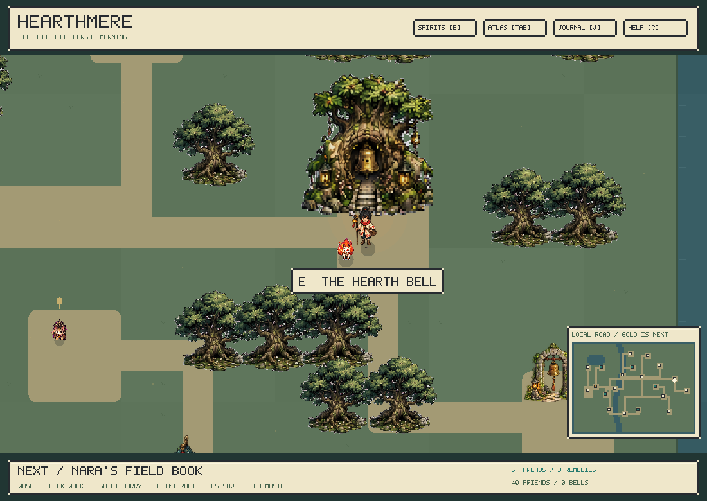

# Tinikami: The Unwritten Road — journey alpha 0.12.1

A creature-collector campaign built around deterministic, real-time C++ combat and lightweight learned spirit pilots. Walk an eight-region road, meet forty original spirits, restore the sanctuary bells, and decide what happens to the broken Crown.

Every species has four signature arts, a distinct passive, directional movement and its own animated sprite sheet. You can let a learned controller pilot your companion or take direct control at any time. The original Windows 95 combat workbench remains available.



## Play

On the development Mac, double-click **`Launch.command`** to play the campaign, or **`Combat Lab.command`** for the combat workbench. `build/Tinikami.app` is a standalone local app; its release ZIP includes SDL2, artwork and both native models. No Python or Torch is required to play.

From source:

```sh
# macOS (C++ command-line tools required)
brew install sdl2
make all test
./build/creature_lab --campaign

# Ubuntu / Linux
sudo apt-get install build-essential libsdl2-dev python3
make all test
./build/creature_lab --campaign

# Combat research workbench
./build/creature_lab --workbench
```

The downloadable macOS app is for Apple Silicon on macOS 14 or newer and is ad hoc signed, not notarized. Building from source is also supported. Windows uses CMake and an SDL2 installation such as vcpkg. Headless builds need no third-party C++ libraries:

```sh
cmake -S . -B build-cmake -DCREATURE_VIEWER=OFF -DCMAKE_BUILD_TYPE=Release
cmake --build build-cmake --config Release
ctest --test-dir build-cmake -C Release --output-on-failure
```

## The journey

- **Eight distinct overworlds and 160 marked locations:** visible spirit habitats, conversations, road trials, memory markers, riddles, sanctuaries and keepers.
- **Forty obtainable companions:** after the opening six completed challenges, a completed first friendly challenge earns recognition even in defeat. Further victories or thread offerings deepen trust. There are no capture dice, random encounters or permanent losses.
- **Three-companion parties:** condition carries across combat relays. Bond experience gradually opens arts, dodge, speed, energy and charms; village requests unlock more preparation choices. The sanctuary recovers everyone freely.
- **An open starter apprenticeship:** explore every Hearthmere habitat immediately; friendship starts after six completed challenges. Fourteen lessons teach keeper calls, cover, a slow charged burst and the lotus. Young spirits begin with one art.
- **An original battle soundtrack:** a 144 BPM chip arrangement with melodic phrases, bass, drums and smooth exploration transitions. F8 toggles music.
- **An in-game design notebook:** F7 pauses play, records feedback and attaches location/encounter context. Notes survive new journeys.
- **Eight optional Lantern Walks:** branching eight-room expeditions, campfires, persistent condition and a final relay. Save between rooms or return home with earned rewards.
- **A complete story route and two endings**, followed by free exploration and collection.
- **1,280 authored animation frames:** four directions × eight poses × forty species. The title screen's Sprite Studio exposes every frame and the wider small/large size range.

**The 20-hour playthrough is a design target, not a verified duration of this alpha.** The complete route and collector systems are implemented; more authored content, encounter tuning and human playtesting are needed to support that length. [Scope, controls, saves and pacing](docs/alpha/journey.md).

## Controls

| Where | Controls |
| --- | --- |
| World | WASD/arrows or click to walk; Shift to hurry; E/Enter to interact |
| Navigation | B companions; Tab travel atlas; J journal; Escape help |
| Combat | M manual/pilot; WASD movement; mouse aim; 1–4 arts; Space dodge |
| Keeper calls | F attack; G fall back; C rest; V trust the spirit. Calls last three combat seconds. |
| Combat tools | P pause; R remedy; Z/X wind strength; H exact geometry; Escape retreat |
| Everywhere | F7 design notebook; F8 music; F5 save outside combat |

Saves live in SDL's per-user application-data directory, separate from the checkout and app bundle. New journeys archive the existing slot. Writes are checksummed and keep a validated backup. Combat resumes from its pre-encounter checkpoint. [Save details](docs/alpha/journey.md#saves).

## Combat and learned pilots

The engine runs at 30 fixed integer ticks per second, with three-tick decisions. Fully developed species share a 100-energy pool across four arts and dodge. Campaign companions start with one art, a 60-energy cap and a slower pace; bond growth expands their kit. Forward travel remains free; sustained hard strafing suppresses regeneration, drains energy and loses lateral drive at low reserves. Finite cornering acceleration prevents instantaneous high-speed changes of travel direction. Planted casts, facing, turn rate, terrain reactions, wind and the central control objective provide counterplay.

Bond 1–2 companions use clearly labeled beginner assistance to approach, face and plant for attacks; bond 3+ uses the learned pilot. Keeper calls are deterministic three-second controller instructions, not newly trained behavior. All campaign fights run at 75% presentation speed: the 90-combat-second limit allows about two real minutes, with pause and the notebook stopping the clock.

The native recurrent controller has **90,727 parameters** and separate memory per actor. Species embeddings, ability-conditioned movement/aim and three temperament inputs support steady, aggressive, skittish, patient and territorial pilots. Campaign companions have reproducible individual trait variations. Gameplay does not silently train or change weights.

Rules are **v9**, observations **v8** (3,628 values), model format **v3**. Older models and replays are rejected. The shipped weights are explicitly expanded from v0.10, then carried forward unchanged after Quillrat burst tuning; they have not been retrained on the development curriculum or keeper calls. Explicit warm-start migration and training provenance are included. [Movement and training results](docs/alpha/footwork.md), [integration contract](docs/integration.md), [model manifest](models/README.md).

## Develop and verify

```sh
make test
python3 tests/viewer_smoke.py
python3 tests/journey_smoke.py
.venv/bin/python tests/learning_tests.py models/apprentice.pt
python3 scripts/compile_campaign.py --check
# Native campaign/controller playthrough, including actual engine outcomes:
make build/campaign_playthrough
./build/campaign_playthrough models/apprentice.tbrain reports/local-playthrough.csv
# Standalone macOS app and ZIP:
sh scripts/package-macos.sh
```

Edit `content/roster.json` and run `make content` for combat data. Edit `content/campaign.json` and run `python3 scripts/compile_campaign.py` for story and authored geography. The renderer and campaign layer are separate from duel physics and the RL ABI. Offline art import requires Pillow, NumPy and SciPy; runtime loads the committed raw atlases directly.

See [apprenticeship, bond progression and design notes](docs/alpha/development.md).

Further design references: [40 species and kits](docs/alpha/species.md), [passives](docs/alpha/passives.md), [wind](docs/alpha/terrain.md), [water/ice/fuel](docs/alpha/elements.md), [garden readability](docs/alpha/gardens.md), [historical temperament work](docs/alpha/temperament.md). Older reports remain historical evidence, not current balance certification.

MIT licensed. Original AI-assisted spirit and environment art, original pixel font and procedural music; no franchise assets. Asset sources and prompts are retained in `assets/tinikami`.
