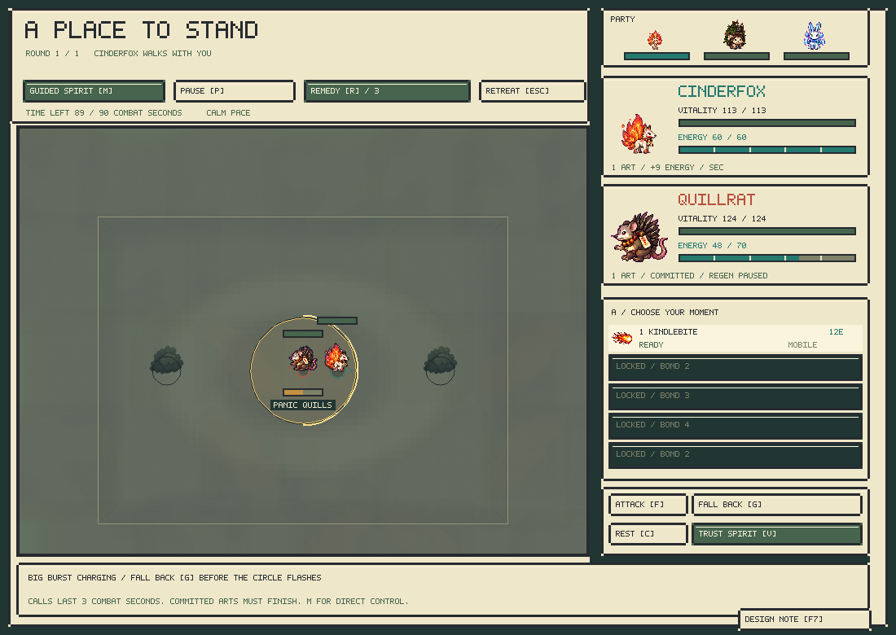
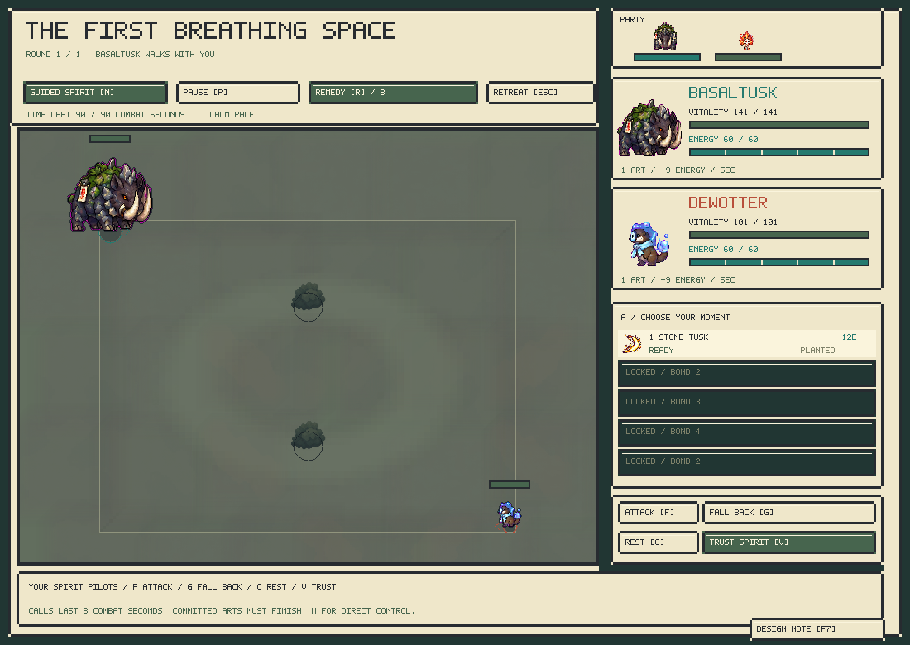

# Apprenticeship and the design notebook — alpha 0.13

The opening teaches one decision at a time. Growing a companion increases its available choices and its capacity to sustain them. HP and damage stay on the authored species budget.


## Bond progression

| Bond | Total XP | Available actions | Movement pace | Energy capacity | Recovery multiplier |
| --- | ---: | --- | ---: | ---: | ---: |
| 1 | 0 | First art | 65% | 60 | 60% |
| 2 | 120 | Second art, dodge, starting charms | 75% | 70 | 70% |
| 3 | 300 | Third art | 85% | 80 | 80% |
| 4 | 600 | Fourth art | 95% | 90 | 90% |
| 5 | 1,000 | Full developed kit | 100% | 100 | 100% |

Pace scales each species' authored forward speed; strafe, reverse and cornering budgets follow it. Species keep their distinct turning, mass, range, cast commitments and passives. Authored lunges retain their art costs; the universal dodge uses its own cooldown and no ability energy. Recovery uses integer units and casting restrictions, without movement penalties. All campaign presentation runs at 75% wall-clock speed; simulation still advances in fixed integer ticks. The combat lab defaults to fully developed bodies.

The active party receives 15 XP per opposing spirit in a won encounter, or 5 for a completed loss. Retreat awards no XP. Bench reserves do not gain battle XP. Village requests still give 60 party XP. The book shows progress to the next threshold and the arts page marks locked arts; a result announces bond growth. Charms pay a percentage of the current energy capacity, rather than bypassing a young companion's limit.

Later recruits bring regional experience: regions 1–2 start at bond 1, 3–4 at bond 2, 5–6 at bond 3, and 7–8 at bond 4. This avoids repeating the entire starter apprenticeship for a late acquisition. No companion's accumulated XP is reduced.

## Hearthmere's opening

The four teachers offer **4 + 4 + 3 + 3 separate duels**, with full-health opponents and free recovery after each win. Teachers and habitats can be visited in any order. The journal suggests an order without blocking exploration. The first two teachers introduce approach, cover, and calling attack/fall back; the later two add mud, water and the lotus.

Quillrat's Panic Quills now has a 60-tick planted startup, 2 active ticks, 54-tick planted recovery, 180-tick cooldown and 3,200-unit radius. Its 16 damage and 22 energy cost are unchanged. The change applies to the species everywhere, including the combat lab. A young Quillrat teacher uses this single art, clearly shown in its HUD; the keeper adds Barb Shot. Both teachers yield the lotus so passive occupation cannot defeat a learner before they have practised the mechanic.

Every local habitat is open from the start. The first six completed challenges are friendly practice with the starter; from the sixth completed challenge onward, wild victories and completed first meetings build trust normally. Completed losses count toward this introduction; retreat does not grant progress. Existing multi-companion saves are grandfathered. Visiting the starter's own species builds bond, not a duplicate. Cinderfox can visit Brambleback or any other local habitat before the keeper. The Hearth Bell is now one full-health Quillrat, not a three-opponent relay. Later regions retain their relays.

New journeys choose **Cinderfox, Brambleback or Galecrest**: close flame pressure, a rooted wish-shrine defender, and a wind spirit with a ranged fan. Rimehare and Dewotter remain obtainable, and existing starter saves remain valid.

**F / Attack, G / Fall Back, C / Rest, V / Trust** work while a spirit pilots itself. A call lasts 90 simulation ticks (four real seconds at the calm presentation speed), cannot cancel an already committed art, and costs no separate resource. The requested art or movement still obeys facing, turning, energy, cooldowns and collision. Falling back turns toward an escape heading and runs forward; rest plants the spirit; attack chooses a legal offensive art and faces before casting. Manual control remains available with M and the numbered arts. The public engine guidance channel is reused, so a future learned response can replace the controller layer without expanding the action interface.

Existing saves retain discovered habitats, companions, XP and story progress. The `TINISAV3` reader migrates a valid `TINISAV2` save and credits previously completed teachers and their minimum training XP for the active party. New bond thresholds apply to retained XP. New saves contain four lesson counters and remain independent of duel snapshots.

## In-game design notes


Press **F7** or click **Design Note** on any campaign screen. The notebook stops world and battle updates without altering whether the battle was already paused. It captures context when an empty draft is opened. Closing and reopening an unfinished draft retains that original context.

- Type or paste feedback. Arrow keys, Home/End, Shift selection, Backspace/Delete, and Ctrl/Command+A/C/X/V support editing.
- Ctrl/Command+Enter or **Save Note and Return** saves the note.
- F7/Escape returns to play and keeps the draft. An ordinary window close saves an unfinished draft as a note; failed writes retain the text and display the error.
- **Previous Note / Next** browse saved notes. Up/Down scroll the saved file. **Open Notes Folder** opens the files in the system file browser.
- Each note is a separate UTF-8 Markdown file. The original pixel font previews ASCII and substitutes unsupported characters; the saved text preserves UTF-8.

On macOS the default folder is:

```text
~/Library/Application Support/Tinikami/The Unwritten Road/design-notes/
```

Notes survive a new journey. Alternate `--save-path` slots use a sibling `design-notes` directory. Context includes UTC time, rules/observation/content/model identities, seed, region/tile, screen, playtime, party, XP and temperament. Battle/result notes add the encounter, round, tick, resources and restrictions, plus a sibling `.crlb` deterministic world snapshot. That snapshot restores engine state; it is not a recorded action trajectory and does not contain recurrent controller memory. It is useful for investigating a combat moment, not automatically replaying the subsequent pilot decisions.

## Presentation follow-up





The camera inset preserves the existing creature sprite sizes while adding room for sprites, health bars and cast labels beyond the physical boundary. The wayfarer uses a separate authored gait sheet with head registration and distance-based playback.


## Learner integration

Rules 9 / observations 8 add four public development fields per actor. These are part of snapshots, hashes and validation; both manual input and learned policies share the same action mask. Global columns 32–35 describe the observing actor and 36–39 the opponent: allowed-art bitmask /31, pace /100, capacity /1000, recovery /100. Self speed and regeneration describe the effective developed values. Existing features retain their positions before the expanded global tail.

`configure_development` / `cr_development` / `Batch.development` configure a world at tick zero. Calls on an already-running world fail. The reference trainer's optional `--development-rate .35` samples matched or adjacent developmental stages in 35% of episodes, leaving other episodes fully developed. It is available in the launcher training scripts too. These are ordinary public scenarios; campaign save data is not injected into the policy.

The shipped model is an explicit expansion of the v0.10 learned controller: eight zero-initialized encoder input columns preserve all previous weights. It has not been retrained on this curriculum. The v0.12 full-health opening exposed severe restricted-kit weaknesses, including Brambleback failing to attack. Bond 1–2 now use a disclosed deterministic beginner motor controller; it approaches, aligns and attacks, with no automatic charged-burst escape. Bond 3+ uses the learned controller. Early temperaments now steer this scaffold: aggressive presses closer between casts, skittish opens space when crowded, patient holds a longer firing lane, and territorial returns toward the lotus. Explicit calls take precedence. These habits are authored, not newly learned. Keeper calls override either pilot for three combat seconds. This is assistance, not an RL training result. The retained v0.10 checkpoint and migration script make that provenance reviewable.
