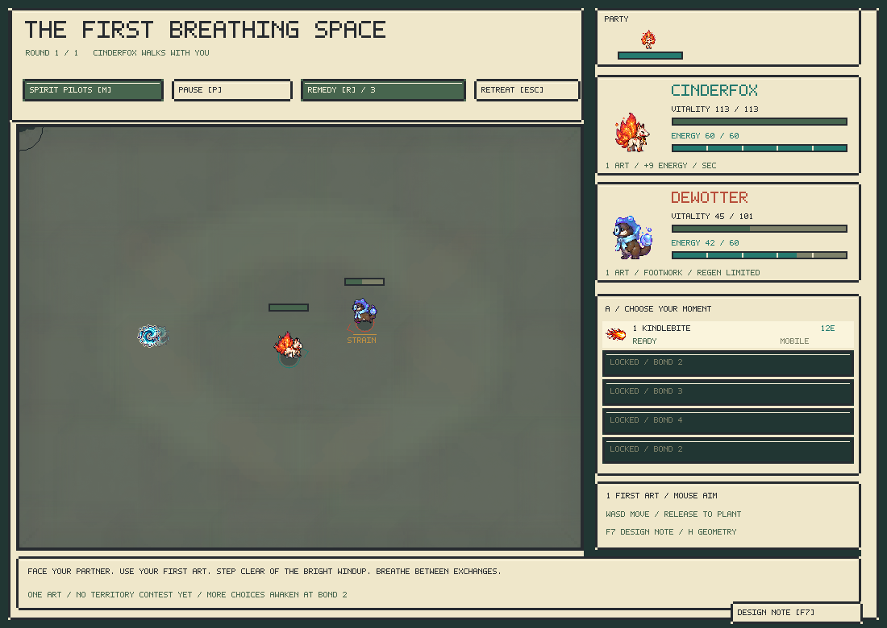
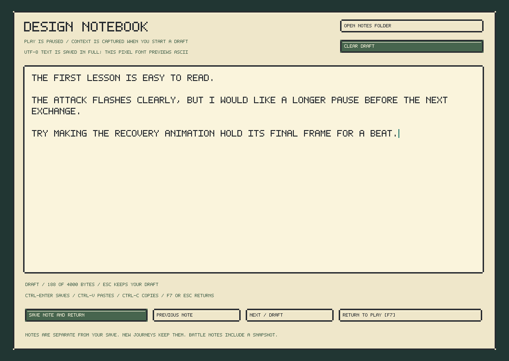

# Apprenticeship and the design notebook — alpha 0.11

The opening teaches one decision at a time. Growing a companion increases its available choices and its capacity to sustain them. HP and damage stay on the authored species budget.



## Bond progression

| Bond | Total XP | Available actions | Movement pace | Energy capacity | Recovery multiplier |
| --- | ---: | --- | ---: | ---: | ---: |
| 1 | 0 | First art | 65% | 60 | 60% |
| 2 | 120 | Second art, dodge, starting charms | 75% | 70 | 70% |
| 3 | 300 | Third art | 85% | 80 | 80% |
| 4 | 600 | Fourth art | 95% | 90 | 90% |
| 5 | 1,000 | Full developed kit | 100% | 100 | 100% |

Pace scales each species' authored forward speed; strafe, reverse and cornering budgets follow it. Species keep their distinct turning, mass, range, cast commitments and passives. Paid lunges/dodges retain their authored bursts once learned. Recovery uses integer units and includes the existing footwork and casting restrictions. Early campaign presentation runs at 80% wall-clock speed while the active companion's bond is 1 or 2; simulation still advances in fixed integer ticks. The combat lab defaults to fully developed bodies.

The active party receives 15 XP per opposing spirit in a won encounter, or 5 for a completed loss. Retreat awards no XP. Bench reserves do not gain battle XP. Village requests still give 60 party XP. The book shows progress to the next threshold and the arts page marks locked arts; a result announces bond growth. Charms pay a percentage of the current energy capacity, rather than bypassing a young companion's limit.

Later recruits bring regional experience: regions 1–2 start at bond 1, 3–4 at bond 2, 5–6 at bond 3, and 7–8 at bond 4. This avoids repeating the entire starter apprenticeship for a late acquisition. No companion's accumulated XP is reduced.

## Hearthmere's opening

The four teachers offer **4 + 4 + 3 + 3 separate duels**, with free recovery after each victory. Each result is a stopping point; the player returns to the same teacher for the next lesson. Losing does not erase completed lessons. The first eight use one-art opponents and teach facing, approach, attack, telegraph, and recovery. Partners deliberately give attack opportunities every three seconds, with pauses to answer. Early teachers use Dewotter and Rimehare; burn-combination Cinderfox opponents are reserved for ordinary encounters. They do not use paid dodges during lessons. The next six use two arts and dodge and introduce the lotus; teachers step away from its centre so the learner can practise claiming it. Keepers contest it normally. Their attack opportunities are 2.5 seconds apart. Practice fields have clear space and no starting surfaces or wind. The first teacher starts with 45% health, later teachers with 60%. These are ordinary visible initial conditions and opponent actions, not hidden damage modifiers.

After eight successful lessons, Ember Footbridge opens. Bramble Clearing opens after the next three; the remaining new habitats open after the Hearth Bell. A player's already-known starter habitat remains accessible. Consequently Cinderfox starters meet their first *new* species at the second habitat; Rimehare and Dewotter can meet Cinderfox at the first. Invitations remain optional. The first three-opponent relay is the Hearth Bell. Later regions retain their fuller terrain and relay structure.

Existing saves retain discovered habitats, companions, XP and story progress. The `TINISAV3` reader migrates a valid `TINISAV2` save and credits previously completed teachers and their minimum training XP for the active party. New bond thresholds apply to retained XP. New saves contain four lesson counters and remain independent of duel snapshots.

## In-game design notes



Press **F7** or click **Design Note** on any campaign screen. The notebook stops world and battle updates without altering whether the battle was already paused. It captures context when an empty draft is opened. Closing and reopening an unfinished draft retains that original context.

- Type or paste feedback. Arrow keys, Home/End, Shift selection, Backspace/Delete, and Ctrl/Command+A/C/X/V support editing.
- Ctrl/Command+Enter or **Save Note and Return** saves the note.
- F7/Escape returns to play and keeps the draft. An ordinary window close saves an unfinished draft as a note; failed writes retain the text and display the error.
- **Previous Note / Next** browse saved notes. Up/Down scroll the saved file. **Open Notes Folder** opens the files in the system file browser.
- Each note is a separate UTF-8 Markdown file. The original pixel font previews ASCII and substitutes unsupported characters; the saved text preserves UTF-8.

On macOS the default folder is:

```text
~/Library/Application Support/Tinikami/The Unwritten Road/design-notes/
```

Notes survive a new journey. Alternate `--save-path` slots use a sibling `design-notes` directory. Context includes UTC time, rules/observation/content/model identities, seed, region/tile, screen, playtime, party, XP and temperament. Battle/result notes add the encounter, round, tick, resources and restrictions, plus a sibling `.crlb` deterministic world snapshot. That snapshot restores engine state; it is not a recorded action trajectory and does not contain recurrent controller memory. It is useful for investigating a combat moment, not automatically replaying the subsequent pilot decisions.

## Learner integration

Rules 9 / observations 8 add four public development fields per actor. These are part of snapshots, hashes and validation; both manual input and learned policies share the same action mask. Global columns 32–35 describe the observing actor and 36–39 the opponent: allowed-art bitmask /31, pace /100, capacity /1000, recovery /100. Self speed and regeneration describe the effective developed values. Existing features retain their positions before the expanded global tail.

`configure_development` / `cr_development` / `Batch.development` configure a world at tick zero. Calls on an already-running world fail. The reference trainer's optional `--development-rate .35` samples matched or adjacent developmental stages in 35% of episodes, leaving other episodes fully developed. It is available in the launcher training scripts too. These are ordinary public scenarios; campaign save data is not injected into the policy.

The shipped model is an explicit expansion of the v0.10 learned controller: eight zero-initialized encoder input columns preserve all previous weights. It has not been retrained on this curriculum. Native/Python inference parity and actual campaign/lesson playthroughs check that it can operate under the new restrictions. The retained v0.10 checkpoint and migration script make that provenance reviewable.
