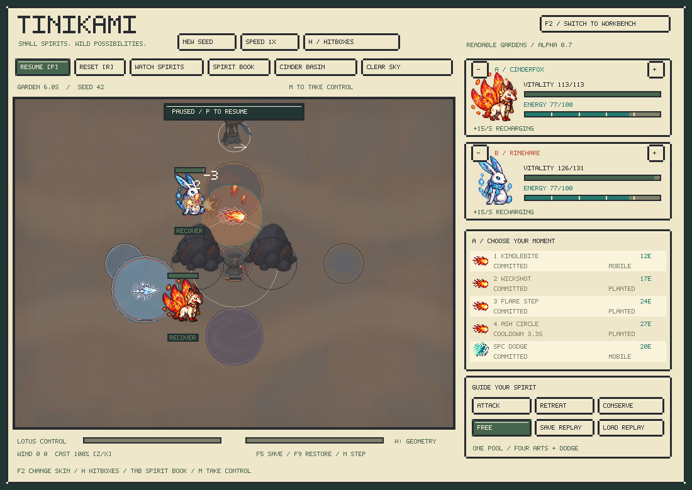
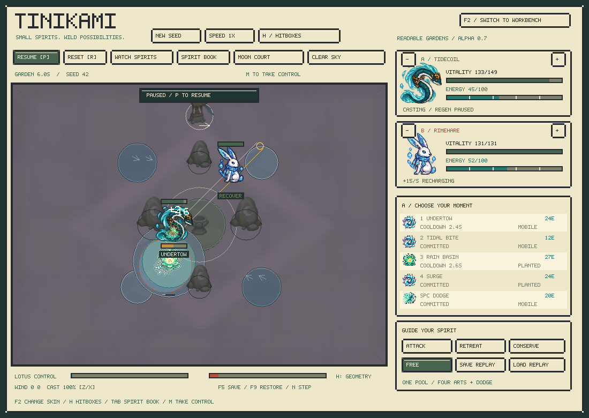
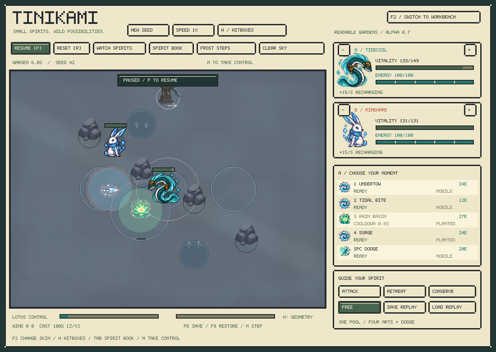

> Historical alpha 0.7 visual/layout release. These gardens remain current; [alpha 0.8](learning.md) adds trained pilots and the latest verification.

# Readable gardens — alpha 0.7

The garden now uses a deliberate visual hierarchy: a quiet floor, readable terrain and cover, distinct spirit silhouettes, then bright active arts. The three original arenas receive new presentation; three additional layouts change the cover and ground that the engine simulates. Energy, moves and creature stats retain the v6 tuning.

## Visual hierarchy

| Layer | Treatment | What it communicates |
|---|---|---|
| Floor | Muted slate, sage, sand, lavender, frost or clay; narrow value range; broad material patches | Place and composition |
| Paths | Wide, faint shapes with soft transitions | Garden identity; purely cosmetic |
| Ground | One large material motif per patch, restrained colored boundary, sparse current arrows | Exact affected area and material |
| Cover | Dark contact outline, more local contrast than the floor | Solid collision geometry |
| Spirits | Original full-color art with a dark one-pixel silhouette rim | Actor identity and position |
| Windup | Amber outline and faint fill; physical facing and commitment cues retained | Where a pending attack threatens |
| Active arts | Brighter elemental colors and a crisp pale rim on spell motifs | Immediate danger and impact |

The former small repeated grass, flowers, cracks and sparkle patterns are replaced by a new 32-cell terrain atlas. Floor tiles have two variants per garden, seeded rotations/reflections, staggered offsets and feathered edges. The result varies without a conspicuous checkerboard. Ground materials use a single broad texture over each patch instead of many tiny repeated tiles. The fighting area stays calm; edge shading frames it.

Color compression happens only when the renderer loads the terrain texture. Ground channels are limited to 45–150 and props to 25–180; alpha blending narrows the visible floor range further. Spirits keep their source colors. The active spell rim reaches RGB 250/244/209. These are display-art choices, not changes to targeting, damage or observations.

Persistent wind arrows and rain are fewer and dimmer. Created/transformed ground now uses a small remaining-life bar instead of numerical countdown text; **H** restores material names, numerical timers and precise geometry. Persistent fire and charged-water embellishments sit below the emphasis of a firing ability. Terrain boundaries remain visible in the regular skin.

## Six layouts

Press **L** or click the garden-name button to cycle. Changing arena restarts the encounter. CLI `--arena` uses the IDs below. **F2** switches the same encounter to the original workbench.

| ID | Garden | Presentation | Gameplay question |
|---|---|---|---|
| 0 | Stone Garden | Slate courtyard, broad squared paving | Play around two pillars and the water/central-ice approach |
| 1 | Moss Grove | Sage floor, looping path, shrub cover | Contest brush and muddy approaches through four pieces of cover |
| 2 | Open Meadow | Warm sand, winding open trail | Manage long sightlines and fuel patches without solid cover |
| 3 | Moon Court | Lavender stone, diamond walk, moon-marked cover | Choose a flank around four cross-arranged blockers; use paired currents and ice |
| 4 | Frost Steps | Blue-gray ground, diagonal route, froststone | Navigate three ice patches and staggered cover; choose whether to shatter or melt the approach |
| 5 | Cinder Basin | Muted clay, upper/lower routes, slag cover | Route around two large central blockers; ignite fuel or exploit muddy approaches |

New cover and neutral ground have 180-degree rotational symmetry, including opposite current vectors. The existing north wind vane and prevailing weather remain asymmetric. This is a layout constraint, not a claim of equal win rates. Each new map starts with five neutral surface patches, retaining room for both creatures' created terrain in the existing sixteen-slot pool. Ice on the new maps persists until transformed or shattered; the original maps keep their earlier thaw behavior.

The core owns all circles, ground placement and material interactions. Rendered paving neither blocks nor slows movement. Cosmetic variation uses a pure hash of coordinates and the world's reset RNG state; rendering never advances that state. Future random simulation events should use a separate stable presentation seed if they begin advancing this RNG during combat.

## Integration

Rules and observations are **v7**, with the existing **3,620-float** actor layout and unchanged content fingerprint `223a8716`. Global column 6 changes from arena ID /2 to /5. The C API exposes `cr_arena_count()` and `cr_arena_name(id)`; Python provides `Batch.arena_names`. The loader rejects older rules/schema contracts. The lightweight policy example retains 82,627 parameters. [Exact contract](../integration.md).

## Validation

- Native suite: **657,508** alpha assertions and **73,881** environment assertions. Counts include repeated state comparisons, not independent design scenarios.
- Every species runs on each of the six maps: safe cover clearance at spawn, public arena feature, surface capacity, new-layout symmetry, deterministic continuation and snapshot restoration.
- Native and Python golden: `21baacb4a80fa3b3`; content fingerprint `223a8716`.
- AddressSanitizer and UndefinedBehaviorSanitizer pass both native suites on this Mac.
- Python batch/scalar parity, arena registry, invalid-reset atomicity, policy inference/action masking/gradient smoke and Gymnasium checker pass.
- Viewer smoke covers all six arenas in both skins, geometry overlays, all forty catalog sprites and repeated identical screenshots. Rendered world hashes match across skins; garden painting never changes the simulation.
- **112,320** scripted matches completed with **zero pool overflows**, mean duration **46.66 seconds**, and seat-A score **51.14%**. Aggregate species scores span **14.4–91.0%**, so roster imbalance remains an explicit playtest target.
- [Six-arena scripted tournament](../../reports/gardens-v7-balance.md) records 72 seeds: all 780 pairs, both seats, three weather states, six maps and four style pairings. This remains a scripted systems diagnostic; it does not establish competitive or learned-policy balance.

## Art source

The new [terrain atlas](../../assets/tinikami/environment-v2.png) was generated with the built-in `image_gen` tool. Its [exact prompt](../../assets/tinikami/environment-v2-prompt.json) is saved alongside it. The lossless `.rgba` export preserves the source; load-time grading and blending live in the renderer. The original v6 atlas remains in the repository for comparison.
