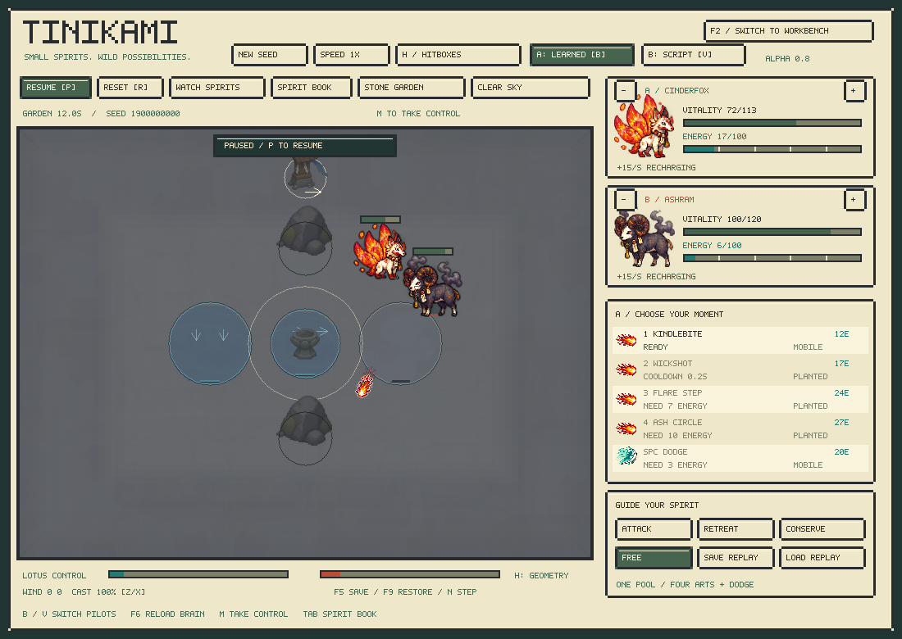
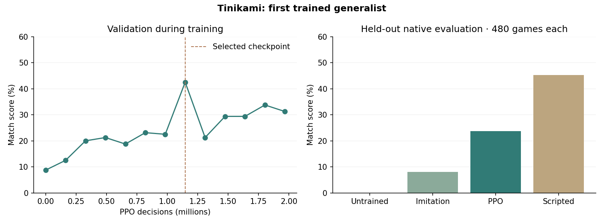

# The first trained apprentice — alpha 0.8

This is the historical v8 release guide. See [alpha 0.9](temperament.md) for current controllers, controls and training commands.

Tinikami now ships a trained recurrent controller, an imitation warm start, recurrent PPO training, native C++ inference, and evaluation against scripted opponents. The default viewer gives A the trained apprentice and B the scripted pilot. Both skins use the same controller.



## Play and train

Double-click `Launch.command`. The game loads `models/apprentice.tbrain`; Python is unnecessary for play. The local `.app` contains the same weights.

- **B:** switch A between learned and scripted control. **V:** switch B. Each actor keeps independent recurrent memory.
- **M:** take human control of A. Returning to the computer clears A's memory after human intervention.
- **F6:** reload the model from disk and begin a fresh encounter. A corrupt/incompatible reload leaves the existing model intact and displays an error.
- **F5/F9:** an in-session fork restores world state and controller memory together. A world snapshot restored from disk starts fresh controller memory and says so. Replays record integer actions and do not require the original model.
- Changing species, map or seed resets the episode and both memories. Switching skins does not.

Double-click **`Train.command`** to continue training from the bundled checkpoint. It creates a local Python environment if needed, retains the optimizer, starts fresh episodes, trains against the scripted styles, and selects by validation score. Resumed training retains the incumbent if the new checkpoints do not improve its validation score. On successful completion it exports the selected model and rebuilds the local Mac bundle. Press F6 to use it. Watching a match does not update weights.

```sh
# Explicit playback modes
./build/creature_lab --pilot-a learned --pilot-b scripted
./build/creature_lab --pilot-a learned --pilot-b learned
./build/creature_lab --pilot-a scripted --pilot-b scripted
./build/creature_lab --brain path/to/model.tbrain --pilot-a learned

# Fresh training (CPU; separate output directory)
make core brain
python3 -m venv .venv
.venv/bin/python -m pip install -r python/requirements-ml.txt
.venv/bin/python python/train.py --out runs/my-first-brain --threads 1

# Continue a checkpoint with fresh episodes and recurrent state
.venv/bin/python python/train.py --resume models/apprentice.pt --out runs/continued --threads 1
.venv/bin/python python/export_brain.py runs/continued/best.pt models/apprentice.tbrain --copy-checkpoint
```

Ctrl-C saves an `interrupted.pt` checkpoint and stops without promoting it. Resume from that file to continue. Resuming preserves optimizer state and weights; it is not a bit-exact restoration of the old rollout environments. Completed checkpoints are written at update boundaries. Use a new output directory for a fresh experiment.

## What the first run learned

The accepted run collected **65,536** scripted demonstration transitions, trained on them for 24 epochs, then collected **1,966,080** on-policy decisions in 64 native arenas. Species, map, weather, seat and opponent spacing style vary between episodes. Ten percent of demonstration travel requests are perturbed so the demonstration states include imperfect movement.

Checkpoint selection used a fixed 80-match validation set. The selected checkpoint is from **1,146,880 PPO decisions**, with a validation score of 42.5%. That small selection set covers all species but only maps 0–3; the trainer now defaults to 240 validation matches. Training itself samples all six maps. The complete configuration and trace are retained in the [report files](../../reports/rl-v8-summary.md).

The final **native** test runs 240 unseen scenarios from both seats, covering all species, maps, weather states and four scripted opponent styles. Every controller gets the same 480 matches. Score counts wins as 1 and draws as 0.5.

| Controller | Native match score |
|---|---:|
| Untrained network | 0.0% |
| Imitation only | 8.0% |
| Imitation + PPO | **23.8%** |
| Scripted style 0 reference | 45.2% |



This is an early generalist. Several species score zero in the small per-species probe. It still mistimes casts, wastes energy and chooses poor routes. The result establishes a working learning path and improvement over imitation on this test population; it does not establish human-level play or roster balance. These tests are correlated scripted scenarios, not independent samples of every opponent a future player could train. Held-out results did not select or tune the shipped checkpoint.

## Controller and action contract

The **86,755-parameter** network encodes self state, an explicit enemy token, pooled public entities, move descriptors, recent events, and global state. A **96-value GRU** carries memory. Heads produce four continuous controls, six masked ability logits, and a training value estimate. The native export is **347,060 bytes**.

The four controls describe movement x/y and aim x/y in an opponent-relative coordinate frame. The frame is computed from the public enemy position. It is an orthonormal change of coordinates: the policy retains full direction and aim-magnitude control. If both positions coincide, physical facing supplies the frame. The decoder rotates to world coordinates, clamps and quantizes with ties away from zero. The engine then applies its existing movement, facing, casting, terrain and energy rules. No scripted action replaces a learned action.

Sampling uses a tanh-transformed diagonal Gaussian for continuous controls and a masked categorical distribution for abilities. PPO stores the original Gaussian samples and their joint log probabilities; it does not reconstruct them from rounded replay actions. Training uses a Gaussian/categorical entropy proxy. In-game inference uses tanh of the mean and the highest legal ability logit; it does not sample.

The actor receives the existing **3,620-float public observation**. It receives no pixels or privileged native pointers. Its own and opponent energy, cooldowns, public cast phases, terrain and currents are already available through that contract.

## Learning objective and updates

A terminal win gives +3, loss −3, draw 0. Potential-based shaping uses health-fraction difference, control difference and a small distance-to-center term:

`reward = terminal_outcome + gamma * Phi(next) - Phi(current)`

`Phi = 2 * (own_hp_fraction - enemy_hp_fraction) + own_control_fraction - enemy_control_fraction - 0.4 * center_distance`

Terminal potential is zero. The 90-second scored verdict is terminal for learning. A rollout horizon that ends during a live game instead bootstraps from the value head. This avoids treating an adjudicated match as an unfinished episode, or rewarding repeated damage/heal cycles with an unbounded contact bonus.

The learner uses [PPO clipping](https://arxiv.org/abs/1707.06347), GAE, clipped value updates, gradient clipping and a KL stop. Defaults are gamma 0.997, lambda 0.95, clip 0.2, three optimization epochs, and 16-decision recurrent sequences. Sequence updates begin with the collected hidden state and recompute recurrence within each sequence. Memory resets at episode boundaries. The boundary hidden state is detached; this is truncated backpropagation, with the usual approximation from carrying collected recurrent states across policy updates.

The native GRU implements the [PyTorch GRUCell equations](https://docs.pytorch.org/docs/stable/generated/torch.nn.GRUCell.html), including the placement of the reset gate on the recurrent candidate term. PyTorch is used only for training/export and the optional parity checks.

## Native integration and compatibility

Simulation rules and observations remain **v7**; content fingerprint remains `223a8716`; the simulation golden remains `21baacb4a80fa3b3`. No creature or combat tuning changes in this release. Brain format **2** identifies the network layout and opponent-relative action codec separately.

`include/creature/brain.hpp` is the C++ controller. `include/creature/brain_api.h` exports a separate optional library, `libtinibrain`, for Python or future Unity bindings. `tb_forward` accepts the flat observation and 96 memory values, and returns mean[4], masked logits[6], value[1], next_memory[96]. `tb_action` applies the deployment decoder and updates memory. The simulation library retains no dependency on this controller or PyTorch.

The `.tbrain` loader checks exact length, format, rules, observations, content, parameter dimensions, finite bounded weights and checksum before replacing an existing model. Float32 payloads are explicitly little-endian. The checksum detects corruption; it is not an authentication signature. `.pt` loads use PyTorch's tensor/basic-type `weights_only` loader.

Neural floating-point inference is not promised bit-identical across all devices. The engine stays deterministic for a given sequence of integer actions. Replays store those actions and verify simulation hashes, so replaying a fight does not rerun the network. Branching a live recurrent policy also requires its corresponding hidden state.

## Verification

- **657,508** native simulation assertions and **73,881** terrain assertions pass with the unchanged golden.
- **21,655** native controller assertions cover 3,582 decisions across all species, action legality, read-only inference, world-plus-memory forks, and action-only replay verification.
- Python/native parity covers both seats and all species: maximum tested float discrepancy **1.9e-6**, identical quantized actions in the 480-step probe.
- Tests cover recurrent PPO likelihood reconstruction across episode boundaries, zeroed reset memory, GAE terminal masks and live-horizon bootstrap, potential telescoping, checkpoint round trips, malformed model rejection and batched teacher parity.
- The resumed-training smoke test retains the incumbent when the new checkpoint ties its validation score.
- Every skin, arena and pilot configuration is exercised by the viewer checks. The native paired comparison has zero pool overflows in all four controller runs.

Shared weights with separate memories are the first step. Persistent per-creature adaptation, human-feedback learning, a self-play opponent league, large training budgets and species-specialist policies remain future work.
