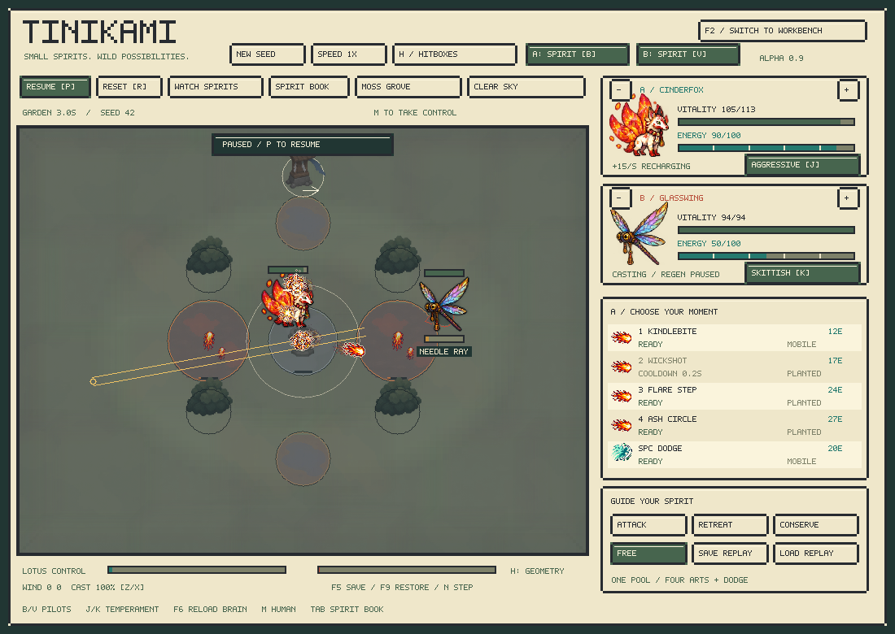

# Stronger pilots and individual temperament — alpha 0.9

This is the historical rules-7 report. For the current game and models, see [the journey](journey.md) and [rules-8 results](../../reports/rl-v10-summary.md). `Combat Lab.command` now opens the workbench described here; `Launch.command` opens the campaign.

Tinikami now has a focused baseline, a temperament-conditioned spirit controller, learned species embeddings, and ability-specific movement and aiming. Both controllers run in native C++; Python is needed only for training. The deterministic combat engine is unchanged.



## Play

Double-click `Launch.command`. A starts with the **baseline**; B starts with the scripted pilot.

- **B / V:** cycle A/B through scripted, spirit, and baseline pilots. The toolbar identifies the active controller.
- **J / K:** cycle A/B through five temperaments. Choosing one activates that actor's spirit controller and clears its recurrent memory. The preference button is highlighted only when it is active.
- **M:** take human control of A. **F6:** reload the two model files and start a fresh encounter.
- Each actor has its own memory and preferences. Changing species or map clears memory and retains the selected temperament. An in-session F5/F9 fork restores controller choice, preferences and memory alongside the world. Disk-only world restores start fresh memory; action replays require neither model nor personality reconstruction.

| Preset | Aggression | Reserve | Territory | Training preference |
|---|---:|---:|---:|---|
| Steady | 0 | 0 | 0 | Match outcome, without an added style reward |
| Aggressive | 1 | −0.25 | 0 | More pressure and less energy hoarding |
| Skittish | −1 | 0.4 | 0 | More separation and a modest energy cushion |
| Patient | 0 | 1 | 0.25 | Keep energy available; a slight territorial preference |
| Territorial | 0 | 0.2 | 1 | Stay nearer the objective with a modest reserve |

The names express training intent. [Measured results](../../reports/rl-v9-summary.md) show how closely the trained policies follow it, for the whole population and each species. Temperament is a preference tradeoff, not a difficulty setting, and equal power across presets is not established.

```sh
./build/creature_lab --pilot-a baseline --pilot-b scripted
./build/creature_lab --personality-a aggressive --personality-b skittish
./build/creature_lab --species-a 2 --traits-a 0.25,0.8,-0.2
./build/creature_lab --species-a 2 --personality-seed-a 42
```

Personality arguments activate the spirit pilot for that actor. A later explicit `--pilot-a baseline` or `scripted` overrides that choice. Custom values must be finite and in `[-1,1]`. An individual seed deterministically creates three values, independent of the encounter seed. Seed 42 gives `(0.8779296875, 0.509765625, −0.3759765625)`. Zero aliases seed one. Seeded mixtures are supported inputs, not individually validated playstyles.

## Current results

On 1,440 fresh native games per controller, v8 scores **22.85%**, the selected controller **37.60%**, and the scripted reference **49.76%**. The winning-only comparison scores **40.52%**; the default had already been selected by validation, and was not reselected using these test results. The selected controller scores **65.31%** against the frozen v8 opponent, which it encountered during training. Twenty-seven of forty species improve on the scripted test; Voltjack remains particularly weak.

Patient averages **26.1 energy** in reserve versus Steady's **19.7**. On identical observation traces, it requests a cast in **37.2%** of selectable decisions versus Steady's **54.4%**. Aggressive/Skittish change approach requests, but their actual match spacing is nearly identical in this cohort. Territorial's average objective distance barely changes. These latter preferences still need stronger behavioral learning; the named input and reward are not evidence of complete personality fidelity.

## What is learned

A single species scalar is a poor way to represent forty unrelated identities. Format 3 adds a learned **40 × 12 embedding table**, used separately for the player's and opponent's species. The rest of the public observation still carries actual body, movement, passive, move and terrain state. Embeddings help the network learn exceptions for particular kits and matchups without changing the engine's observation schema.

The policy also conditions movement and aim on the selected ability. Its distribution first chooses a legal ability, then uses that ability's continuous-control mean. A projectile, a ground field and a dodge can now ask for different aim magnitudes or movement from the same observed state. PPO stores the sampled ability and unrounded Gaussian controls and recomputes their joint likelihood during recurrent updates.

Three persistent preference values enter the encoder alongside the observations and species embeddings. They are individual configuration, not random weight noise, and they are supplied at every decision so memory does not have to remember an initialization pulse. The network has **89,959 parameters**, a **96-value GRU**, and a **359,876-byte** native export per model.

The focused baseline always uses neutral preferences. The spirit controller uses the actor's selected values. `champion.tbrain` is selected by neutral validation score across the completed trials; `apprentice.tbrain` is the selected temperament model. They can initially contain the same weights when the temperament trial produces the strongest neutral pilot. The two training launchers let these copies continue independently.

## Training and individual fine-tuning

- **`Train.command`:** improve the focused baseline and export `models/champion.tbrain`.
- **`Train Spirits.command`:** continue mixed-temperament training and export `models/apprentice.tbrain`.

Both retain optimizer state, begin fresh episodes, preserve the incumbent unless validation improves, and package the result into the local Mac app. They train against scripted styles and a configured mixture of frozen learned opponents. Press F6 afterward. Watching fights and pressing praise/correction do not update weights; learned obedience to the guidance buttons is not validated in this release.

For an individual or species specialist, keep a separate output/model path:

```sh
# A skittish Glasswing, initialized from the focused baseline.
.venv/bin/python python/train.py --resume models/champion.pt \
  --species 2 --personality skittish --out runs/skittish-glasswing \
  --opponent models/baselines/apprentice-v8.pt --threads 1
.venv/bin/python python/export_brain.py runs/skittish-glasswing/best.pt models/individuals/glasswing.tbrain --copy-checkpoint
./build/creature_lab --brain models/individuals/glasswing.tbrain --species-a 2 --personality-a skittish

# The same individual seed can initialize play and fine-tuning.
.venv/bin/python python/train.py --resume models/champion.pt \
  --species 2 --individual-seed 42 --out runs/glasswing-42 --threads 1
```

A specialist run trains and validates the chosen learner species and preference against varied opponents, maps, weather and seats. Its checkpoint still accepts all species; competence outside its training focus is not implied. The supplied generalists were trained across all forty species. Specialist CLI paths are tested, but no forty-model specialist population is claimed.

## Objectives and evidence

The two completed trials start from the v8 apprentice. The temperament trial adds 131,072 labeled transitions from a mixture of scripted and apprentice-driven play, 32 imitation epochs, and 5,242,880 new PPO decisions. The winning-only comparison adds 3,276,800 PPO decisions. Both use learned species embeddings and conditional controls. They differ in seed, curriculum, budget and preference sampling; their score gap is not a controlled causal ablation of personality.

Terminal outcome remains +3 for a win, −3 for a loss and zero for a draw. Health/control potential shaping remains, with terminal potential zero. Gamma is 0.9995. Temperament adds a bounded per-decision preference reward:

`0.003 * dot(preferences, [1 − 2 clamp(enemy_distance / 10), 2 energy_fraction − 1, 1 − 2 clamp(objective_distance / 10)])`

This term is deliberately **not** potential shaping: it changes which style the policy prefers. Steady receives zero style reward. No trait changes movement speed, cooldowns, energy regeneration, damage or other combat rules. Winning is evaluated separately from the training reward.

Validation uses a fixed 240-game cohort. The release test uses 720 fresh scenarios from both seats: **1,440 games per controller/preset**, covering every species on each of six maps in each of three weather states. The selection manifest freezes model hashes before the test. Identical-observation probes separately compare all five temperaments on the same scripted trajectories, carrying separate memories. See the [full results, learning curves and forty-species table](../../reports/rl-v9-summary.md).

This is still a small shared controller with scripted and frozen-opponent experience. It does not establish expert kit execution, equal species power, human-level play, or robustness against a mature self-play league. Persistent personal weights are possible through the fine-tuning path; the app does not automatically train every creature while it fights.

## Native integration and compatibility

Rules and observations stay **v7**, content `223a8716`, simulation golden `21baacb4a80fa3b3`. Brain format **3** describes the new parameter layout, conditional action distribution and three preferences. Format-2 models still load and play with neutral preferences; non-neutral inputs are rejected. Python can upgrade format-2 checkpoints while preserving their neutral function up to floating-point summation, then train the new pathways.

`Brain::action(observation, memory, personality)` and C functions `tb_action_personality` / `tb_forward_personality` accept the three values separately. Old C entry points use neutral preferences. `tb_forward_personality` returns the four continuous means for the **highest-logit legal ability**, six masked logits, value, and next memory—107 floats. It is a deterministic deployment interface, not an interface for resampling arbitrary abilities afterward.

The caller owns the 96 memory values and three preferences for each actor. Save both, plus the model identity, when branching a controller. Floating-point neural inference may differ slightly between platforms; action recording preserves deterministic simulation replay. Tests cover both brain formats, recurrent likelihood reconstruction with personality and conditional actions, Python/native parity, malformed models and preferences, seeded identities, species-specific training, and both skins' controller configurations.

The design uses the general idea of conditioning a shared function on its task/preferences, as in [Universal Value Function Approximators](https://proceedings.mlr.press/v37/schaul15.pdf), together with [PPO](https://arxiv.org/abs/1707.06347). The reward and personality design here are project-specific choices.
