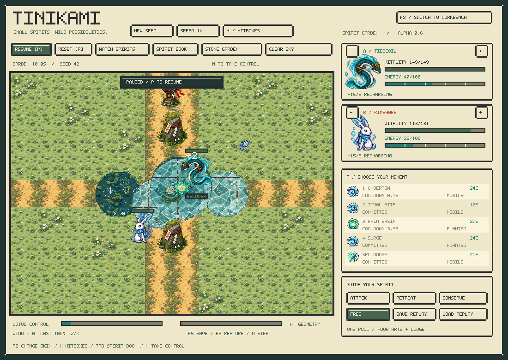
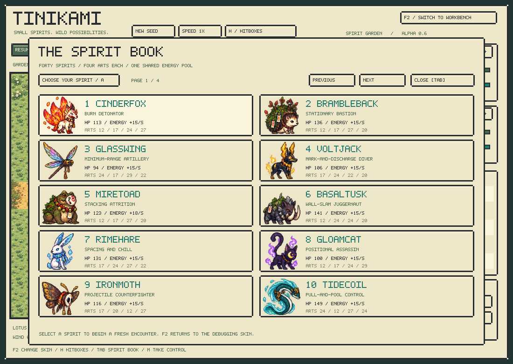

# Tinikami alpha 0.6: energy and spirit garden

Tinikami adds an illustrated spirit skin over the same deterministic C++ engine and makes energy a consequential shared budget. The original Windows 95 skin remains available. The 40 species keep their stable identities and kits; their new artwork interprets them as small nature/shrine spirits.

## Play and switch skins

Double-click `Launch.command`, or run `./build/creature_lab`. The default skin is Tinikami. Press **F2** to switch skins without restarting, **H** for physical hitboxes, **Tab** for the spirit book, **M** to take control of A, and **P** to pause/resume. Both skins accept the same mouse/keyboard commands, snapshots and replays. `--skin debug` starts the old workbench. The speed button remains visible; pacing figures below use 1× speed.

WASD moves, mouse requests facing and ground placement, 1–4 requests an art, and Space plus a direction requests dodge. Z/X adjusts wind-cast power. The ground chevron remains authoritative facing even when the illustrated body flips horizontally. The lotus is the existing bloom control objective; the wooden shrine is the existing wind vane.

## Energy contract

- Each spirit starts with **100 displayed energy** (1,000 integer units internally). Its four arts and shared dodge draw from that one pool. The two opponents have independent pools.
- Accepted casts pay immediately and suppress base regeneration for at least **0.8 seconds**. Base regeneration additionally requires idle or recovery phase, so a longer windup/active phase keeps it paused. There is no extra regeneration lock on normal completion. Interruptions impose at least 0.4 seconds of lock.
- Ordinary spirits regenerate **15 displayed energy/second** when eligible. Clockfin, Coppergecko and Saltcrab have 9 base; Miretoad has 18. Regeneration may resume during recovery even though another art is not yet legal.
- Movement and turning cost nothing. A regeneration lock does not itself forbid an otherwise legal cast. A rejected request spends nothing; each art still has its own cooldown.
- Signature art costs are 8–40 displayed energy. Shared dodge costs **20**, starts in one tick, has six active ticks and twelve recovery ticks, and recharges in 1.6 seconds.
- Saltcrab adds 21 displayed energy/second while guarding, independently of the base lock. Clockfin refunds 7 on alternating slots; Coppergecko refunds 12 every third cast. These are deliberate ways to bend the economy.

For example, Tidecoil's Rain Basin costs 27 energy, Undertow 24, and dodge 20. Spending on both leaves 49 before regeneration; another substantial cast changes the escape budget. The legal mask does not enforce a reserve: choosing to risk the last energy is part of piloting.

The HUD shows both reserves, move costs, cooldowns, missing energy and current regeneration state. Observations expose the enemy reserve and both regeneration states, so future lightweight agents can learn these choices from semantic inputs. Rules/observation version is **6**; tensor dimensions stay **3,620 floats**. [Exact integration contract](../integration.md).

## Tempo changes and evidence

Body speed is approximately 15% lower. Signature windups increase about 35%; recoveries and cooldowns about 25%. Projectile/lunge speeds decrease 15%. Integer rounding preserves authored distinctions; active hit windows and terrain durations stay unchanged. Dodge remains a quick defensive response. [Every numeric content change and tuning iteration](../../reports/energy-v6-changes.json) is recorded.

The initial energy restriction was too severe and produced excessive clock verdicts. Allowing regeneration during recovery after the spending lock restored shorter cycles while retaining a finite burst budget.

| Matched 720-game pacing probe | Alpha 0.5 | Alpha 0.6 |
|---|---:|---:|
| Casts per spirit per minute | 63.35 | 32.31 |
| Mean duration | 21.63 s | 46.24 s |
| Mean displayed reserve | 66.81 | 24.12 |
| Decisions below current dodge cost | 13.61% | 45.09% |

The probe uses all 40 spirits against a fixed offset opponent, nine map/weather combinations and both seats, seeds 4200–4208. It compares each version's bundled scripted pilots, including v6's soft dodge-reserve preference; it is not an isolated causal estimate of energy alone. These pilots often spend too aggressively. Low-reserve frequency is evidence that saving matters, not a desired target for human or learned play. Source: [benchmark](../../tests/pacing_benchmark.cpp), [v5 metrics](../../reports/pacing-v5.json), [v6 metrics](../../reports/pacing-v6.json).

The separate 56,160-match four-style matrix averages **44.72 seconds**, versus v5's 22.40. Zero allocation overflow occurred; seat-A score is 52.19%. About 11.5% reach the 90-second verdict. Aggregate species scores range **13.3–87.0%**. This economy changes relative power substantially, and the roster is not balance-certified. Static scripted pilots do not establish a learned-policy ceiling. [Full diagnostic](../../reports/energy-v6-balance.md).

## Skin architecture and art scope

`client/tinikami.hpp` renders a const world and emits the existing UI commands. It never steps simulation state. It draws 40 individual spirit sprites, twelve terrain textures, shrine/stone/lotus props and sixteen reusable effect motifs. Each art combines its element, form, range, radius, trajectory and timing into its visual. Windup contours remain visible; H adds exact body/obstacle/projectile collision outlines. The original workbench remains the detailed event inspector.

Sprites currently use one illustrated pose with facing flips, motion bob and casting cues. Spell trails, impacts, healing, shields, terrain flames and wind animate from public simulation time/events. Authored directional walk/attack frame sets are future art work. This is a functional first skin, not a claim that all 160 moves have bespoke frame animations.

All artwork was generated with the built-in `image_gen` tool and saved in `assets/tinikami`, with [exact prompts and asset notes](../../assets/tinikami/README.md). Source PNGs preserve transparency. A Pillow authoring script decodes them losslessly to a tiny RGBA format, so runtime still depends only on SDL2. The core has no art or Python dependency. The local macOS bundle includes its textures and uses the installed SDL2 library.

## Validation

- **656,741 alpha checks**, **279 environment checks**, native/Python golden replay and snapshot compatibility checks passed.
- Address/undefined-behavior sanitizer runs cover both native suites.
- Both skins, H geometry and all four catalog pages render the same seeded world hash; all 40 atlas entries are exercised.
- The 82,627-parameter reference policy's inference/masks/native submission/gradients and the Gymnasium checker passed. Weights remain random; no trained policy or learner is shipped.
- Content fingerprint `223a8716`; shared replay golden `dd03362d679bb37a`. Old rules/schema snapshots and models are incompatible.
