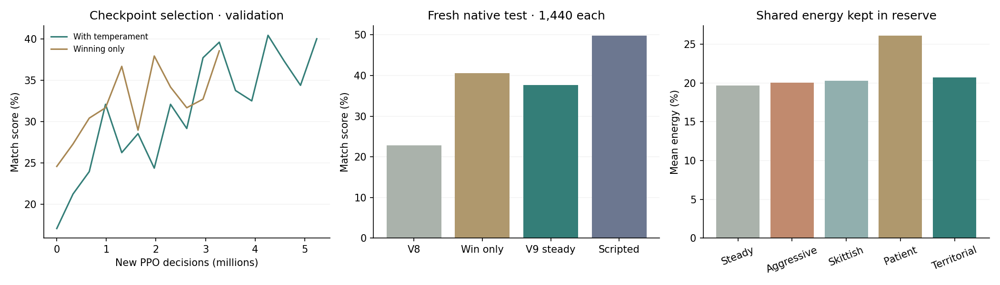
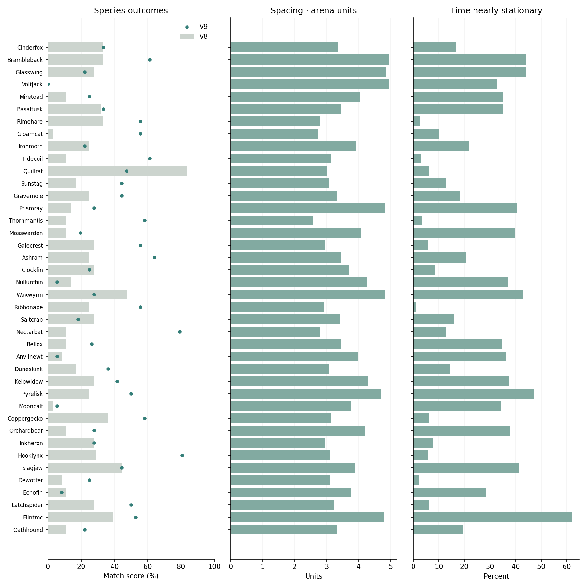

# Tinikami: stronger pilots and temperament

Each controller gets the same 1,440 native games: 720 scenarios played from both seats, with every species on all six maps in all three weather states. Opponents cover 18 pairings per species and four scripted styles. Score awards draws half credit. The selected weights were frozen before this fresh test.

| Controller | Match score | Mean fight | Casts / minute |
|---|---:|---:|---:|
| Previous v8 apprentice | 22.85% | 47.2s | 32.2 |
| Winning-only continuation | 40.52% | 38.1s | 33.9 |
| V9 steady temperament | 37.60% | 36.5s | 36.3 |
| Scripted reference | 49.76% | 50.7s | 29.5 |

The default baseline was selected from the temperament trial by validation before this test. Its neutral weights are initially identical to the spirit model. The winning-only comparison scored higher on this fresh test; it was retained as a comparison, without using test scores to reselect the default. Against the frozen v8 learned opponent, the selected baseline scored 65.31% in another 1,440 paired games. That opponent appeared during training, so this is progress against a known controller, not unseen-opponent evidence.

## Measured temperament

Preferences change policy decisions; they do not change stats, cooldowns, energy rules or collision. Distance and energy below are weighted by observed decision time. Different policies induce different fights, so the same-observation probe below is also provided.

| Temperament | Score | Enemy distance | Objective distance | Energy reserve | Casts / minute |
|---|---:|---:|---:|---:|---:|
| Steady | 37.60% | 3.58 | 3.86 | 19.7% | 36.3 |
| Aggressive | 39.90% | 3.57 | 3.87 | 20.1% | 36.2 |
| Skittish | 38.37% | 3.58 | 4.00 | 20.3% | 36.1 |
| Patient | 38.06% | 3.52 | 3.83 | 26.1% | 34.6 |
| Territorial | 39.41% | 3.65 | 3.85 | 20.7% | 37.1 |

Distance is in arena units. Energy reserve is the mean fraction of the shared 100-energy pool. Temperament is a preference tradeoff, not a difficulty setting; preset names describe training intent, and this table records what actually happened.

## Same observations, different preferences

All five policies receive the same scripted observation sequences for each species and seat. Each carries its own recurrent memory through that identical sequence. Their actions do not drive the probe world. This isolates response to temperament from changes in the opponent or map trajectory; it is a behavioral diagnostic, not a win-rate evaluation.

| Temperament | Decisions differing from steady | Toward-enemy request | Cast when selectable |
|---|---:|---:|---:|
| Steady | 0.0% | 0.555 | 54.4% |
| Aggressive | 100.0% | 0.604 | 52.5% |
| Skittish | 100.0% | 0.505 | 53.3% |
| Patient | 100.0% | 0.545 | 37.2% |
| Territorial | 100.0% | 0.675 | 57.5% |

## Species differentiation

Thirty-six paired test games per species are a diagnostic sample, not a balance verdict. Favorite art is the most frequently accepted signature cast, excluding dodge. Full slot distributions and each temperament’s species-level results are in [the CSV](rl-v9-species.csv).

| Species | V8 score | V9 score | Distance | Stationary | Favorite art |
|---|---:|---:|---:|---:|---|
| Cinderfox | 33.3% | 33.3% | 3.35 | 16.6% | Wickshot |
| Brambleback | 33.3% | 61.1% | 4.95 | 44.1% | Briar Club |
| Glasswing | 27.8% | 22.2% | 4.87 | 44.2% | Glass Shards |
| Voltjack | 0.0% | 0.0% | 4.94 | 32.8% | Spark Pin |
| Miretoad | 11.1% | 25.0% | 4.05 | 35.1% | Spitball |
| Basaltusk | 31.9% | 33.3% | 3.45 | 35.1% | Stone Tusk |
| Rimehare | 33.3% | 55.6% | 2.79 | 2.6% | Icicle |
| Gloamcat | 2.8% | 55.6% | 2.72 | 10.1% | Backfang |
| Ironmoth | 25.0% | 22.2% | 3.92 | 21.6% | Steel Dust |
| Tidecoil | 11.1% | 61.1% | 3.14 | 3.2% | Tidal Bite |
| Quillrat | 83.3% | 47.2% | 3.02 | 5.9% | Barb Shot |
| Sunstag | 16.7% | 44.4% | 3.08 | 12.7% | Sun Antler |
| Gravemole | 25.0% | 44.4% | 3.31 | 18.2% | Grave Claw |
| Prismray | 13.9% | 27.8% | 4.82 | 40.6% | Prism Dart |
| Thornmantis | 11.1% | 58.3% | 2.59 | 3.3% | Harvest Cut |
| Mosswarden | 11.1% | 19.4% | 4.08 | 39.8% | Seed Bomb |
| Galecrest | 27.8% | 55.6% | 2.96 | 5.8% | Feather Fan |
| Ashram | 25.0% | 63.9% | 3.44 | 20.7% | Blood Horn |
| Clockfin | 27.8% | 25.0% | 3.70 | 8.4% | Tick |
| Nullurchin | 13.9% | 5.6% | 4.26 | 37.1% | Null Spine |
| Waxwyrm | 47.2% | 27.8% | 4.84 | 43.1% | Wax Glob |
| Ribbonape | 25.0% | 55.6% | 2.91 | 1.3% | Ribbon Throw |
| Saltcrab | 27.8% | 18.1% | 3.43 | 15.9% | Closed Shell |
| Nectarbat | 11.1% | 79.2% | 2.79 | 12.9% | Siphon Fang |
| Bellox | 11.1% | 26.4% | 3.45 | 34.5% | Clapper |
| Anvilnewt | 8.3% | 5.6% | 3.99 | 36.4% | Forged Bolt |
| Duneskink | 16.7% | 36.1% | 3.08 | 14.2% | Sandlash |
| Kelpwidow | 27.8% | 41.7% | 4.29 | 37.3% | Kelp Harpoon |
| Pyrelisk | 25.0% | 50.0% | 4.68 | 47.2% | Coal Fan |
| Mooncalf | 2.8% | 5.6% | 3.75 | 34.4% | Moon Tap |
| Coppergecko | 36.1% | 58.3% | 3.13 | 6.2% | Copper Ping |
| Orchardboar | 11.1% | 27.8% | 4.21 | 37.8% | Root Tusk |
| Inkheron | 27.8% | 27.8% | 2.96 | 7.8% | Ink Needle |
| Hooklynx | 29.2% | 80.6% | 3.10 | 5.6% | Claim Claw |
| Slagjaw | 44.4% | 44.4% | 3.88 | 41.4% | Corrosive Bite |
| Dewotter | 8.3% | 25.0% | 3.11 | 2.2% | Dew Dart |
| Echofin | 11.1% | 8.3% | 3.76 | 28.4% | Echo Fan |
| Latchspider | 27.8% | 50.0% | 3.24 | 6.0% | Silk Dart |
| Flintroc | 38.9% | 52.8% | 4.81 | 61.9% | Flint Cannon |
| Oathhound | 11.1% | 22.2% | 3.33 | 19.3% | Oath Fang |

The two training trials differ in curriculum, seed, training length and preference sampling; their score gap is not a clean causal ablation of personality. The scenarios are paired and correlated. These descriptive scores do not establish human-level play, unseen-opponent robustness or a solved roster. The legacy v8 report used a smaller, differently crossed scenario grid and must not be compared directly to these percentages. Raw evaluation CSVs, training configurations, learning traces, model exports and hashes are preserved.

